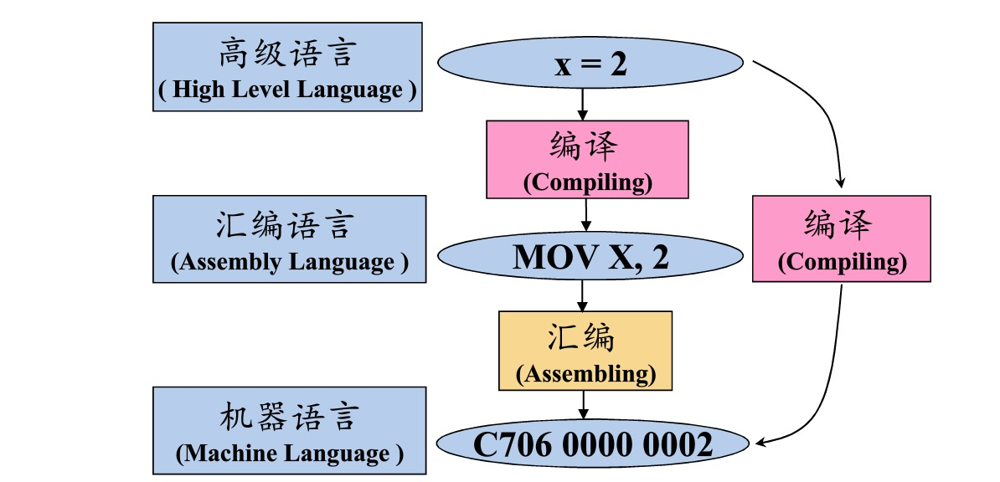
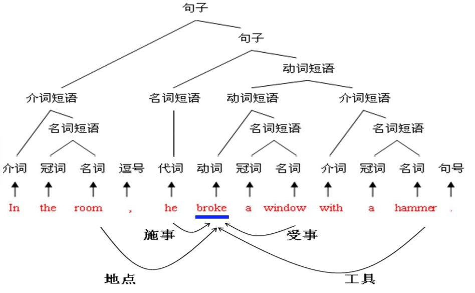

## 什么是编译

编译：就是将高级语言（源语言）翻译成汇编语言或者机器语言（目标语言）的过程。



## 编译步骤

 - 词法分析：确定句子中各个单词的词性，例如名词、代词、介词等； 
 - 语法分析：识别句子中的各个短语，例如名词短语、动词短语等，从而获得句子的结构。
 - 语义分析：划分句子成分，例如哪个是谓语、主语等，确定与核心谓语之间的关系。

 

 ## 语言及其文法

 ### 字母表运算

 - 字母表∑1和∑2的乘积( product)
 - 字母表∑的n次幂( power)

> 字母表的n次幂：长度为n的符号串构成的集合

 - 字母表∑的正闭包( positive closure)

> 字母表的正闭包：长度正数的符号串构成的集合

 - 字母表∑的克林闭包(Kleene closure)

> 字母表的克林闭包：任意符号串（长度可以为零）构成的集合

### 句子的构成规则

```js
< 句子 > → < 名词短语 > < 动词短语 >
< 名词短语> → < 形容词 > < 名词短语 >
< 名词短语 > → < 名词 > 
< 动词短语 > → < 动词 > < 名词短语 >
```

### 文法分类
